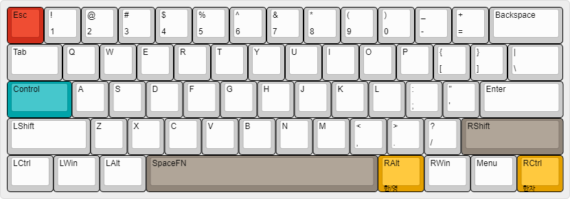
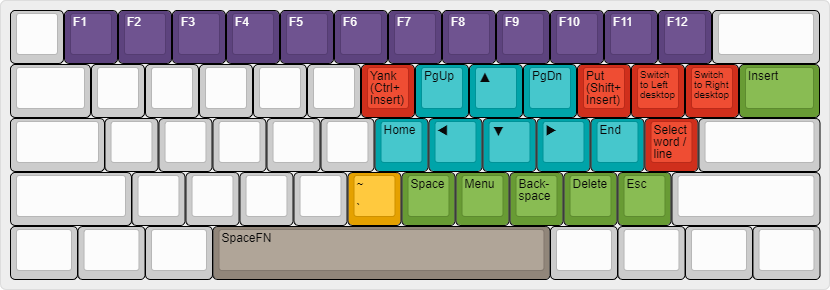
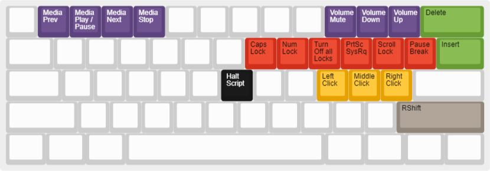

# Keyboard-Remapper

> Quick responsive, lightweight, reliable keyboard remapper for Windows power users.\
> Maximize your work efficiency.

> 내가 쓰려고 만든 키보드 리매퍼\
> 가볍고, 안정적이고, 입력에 즉각적으로 반응합니다.\
> 작업 효율을 최대화하세요.

## Features

* All shortcuts can be used with the modifier keys. (Ctrl, Alt, Shift, Win)
  * 모든 단축키는 수정자와 함께 조합해서 사용할 수 있습니다.
  
* Built with [AutoHotkey v2](https://github.com/AutoHotkey/AutoHotkey), it responds immediately and accurately to your keystrokes.
  * 오토핫키 v2로 컴파일하여 키보드 입력에 즉각적이고 정확하게 반응합니다.
  
* This keyboard remapper uses the SpaceFn layer method, which is especially useful for mini layout keyboards that don't have arrow keys or function keys.
  * SpaceFn 레이어 방식을 채택하여, 방향키나 펑션키가 없는 미니 레이아웃 키보드에서 특히 유용합니다.

## User Manual

### Base layer

[keyboard-layout-editor-base](http://www.keyboard-layout-editor.com/##@_author=Ahn%20Giju&notes=v1.2.0%0A%0A20231210%2F:%20Restore%20RShift-layer%20for%20RWinless%20keyboard(e.g.%20LEOPOLD%20660)%0A%0Av1.1.0%0A%0A20231113%2F:%20Remove%20RShift-layer,%20Import%20RWin-layer%0A%0Av1.0.0%0A%0A20231009%2F:%20Base%20layer%3B&@_c=%23d02f1c%3B&=Esc&_c=%23cccccc%3B&=!%0A1&=%2F@%0A2&=%23%0A3&=$%0A4&=%25%0A5&=%5E%0A6&=%2F&%0A7&=*%0A8&=(%0A9&=)%0A0&=%2F_%0A-&=+%0A%2F=&_w:2%3B&=Backspace%3B&@_w:1.5%3B&=Tab&=Q&=W&=E&=R&=T&=Y&=U&=I&=O&=P&=%7B%0A%5B&=%7D%0A%5D&_w:1.5%3B&=%7C%0A%5C%3B&@_c=%2300a4a9&w:1.75%3B&=Control&_c=%23cccccc%3B&=A&=S&=D&=F&=G&=H&=J&=K&=L&=%2F:%0A%2F%3B&=%22%0A'&_w:2.25%3B&=Enter%3B&@_w:2.25%3B&=LShift&=Z&=X&=C&=V&=B&=N&=M&=%3C%0A,&=%3E%0A.&=%3F%0A%2F%2F&_c=%2391867a&w:2.75%3B&=RShift%3B&@_c=%23cccccc&w:1.25%3B&=LCtrl&_w:1.25%3B&=LWin&_w:1.25%3B&=LAlt&_c=%2391867a&w:6.25%3B&=SpaceFN&_c=%23e5a100&a:0&w:1.25%3B&=RAlt%0A%0A%0A%0A%ED%95%9C%2F%2F%EC%98%81&_c=%23cccccc&a:4&w:1.25%3B&=RWin&_w:1.25%3B&=Menu&_c=%23e5a100&a:0&w:1.25%3B&=RCtrl%0A%0A%0A%0A%ED%95%9C%EC%9E%90)

### SpaceFN layer
Spacebar 를 누르고 있는 동안 활성화되는 레이어입니다.

[keyboard-layout-editor-spacefn](http://www.keyboard-layout-editor.com/##@_author=Ahn%20Giju&notes=v2.0.0%0A%0A20231210%2F:%20upgrade%20functionality%0A%0Av1.2.0%0A%0A20231111%2F:%20fully%20redesigned,%20Add%20function%20row%20in%20spacefn%20%2F&%20etc.%0A%0Av1.1.0%0A%0A20231027%2F:%20Navigation%20keys%20reconfiguration%20and%20layout%20optimization%0A%0Av1.0.0%0A%0A20231009%2F:%20SpaceFN%20layer%3B&@_a:7%3B&=&_c=%235d437e&t=%23ffffff&a:4%3B&=F1&=F2&=F3&=F4&=F5&=F6&=F7&=F8&=F9&=F10&=F11&=F12&_c=%23cccccc&t=%23000000&a:7&w:2%3B&=%3B&@_w:1.5%3B&=&=&=&=&=&=&_c=%23d02f1c&a:4%3B&=Yank%20(Ctrl+%20Insert)&_c=%2300a4a9%3B&=PgUp&_f:4%3B&=%E2%96%B2&_f:3%3B&=PgDn&_c=%23d02f1c%3B&=Put%20(Shift+%20Insert)&_f:2%3B&=Switch%20to%20Left%20desktop&=Switch%20to%20Right%20desktop&_c=%23689b34&f:3&w:1.5%3B&=Insert%3B&@_c=%23cccccc&a:7&w:1.75%3B&=&=&=&=&=&=&_c=%2300a4a9&a:4%3B&=Home&=%E2%97%80&_f:4%3B&=%E2%96%BC&_f:3%3B&=%E2%96%B6&=End&_c=%23d02f1c%3B&=Select%20word%20%2F%2F%20line&_c=%23cccccc&a:7&w:2.25%3B&=%3B&@_w:2.25%3B&=&=&=&=&=&_c=%23e5a100&a:4%3B&=~%0A%60&_c=%23689b34%3B&=Space&=Menu&=Back-space&=Delete&=Esc&_c=%23cccccc&a:7&w:2.75%3B&=%3B&@_w:1.25%3B&=&_w:1.25%3B&=&_w:1.25%3B&=&_c=%2391867a&a:4&w:6.25%3B&=SpaceFN&_c=%23cccccc&a:7&w:1.25%3B&=&_w:1.25%3B&=&_w:1.25%3B&=&_w:1.25%3B&=)

### RShiftFN layer
RShift 를 누르고 있는 동안 활성화되는 레이어입니다.

[keyboard-layout-editor-rshiftfn](http://www.keyboard-layout-editor.com/##@_notes=v3.1.0%0A%0A20231211%2F:%20Discard%20RWin%20layer%20%2F&%20optimize%20RShift%20layer%20for%20Winkeyless%20keyboards%20%2F&%20gaming%0A%0Av3.0.0%0A%0A20231210%2F:%20Remove%20mouse%20action,%20keyboard%20should%20function%20as%20a%20keyboard%20%2F&%20Win+L%20for%20lock%20screen%0A%0Av2.0.0%0A%0A20231113%2F:%20Fully%20redesigned,%20RShift%20layer%20%E2%86%92%20RWin%20layer%0A%0Av1.1.1%0A%0A20231026%2F:%20Remove%20'Task%20View'(WIN+Tab),%20retrieve%20closed%20tab%20%2F=%20ctrl+rshift+t%20%2F&%20add%20'turn%20off%20all%20locks'%20(only%20in%20ahk%20version)%0A%0Av1.1.0%0A%0A20231026%2F:%20Lock%20keys%20have%20been%20rearranged%20and%20mouse%20actions%20added%0A%0Av1.0.0%0A%0A20231009%2F:%20RShift%20layer%3B&@_a:7%3B&=&_c=%235d437e&t=%23ffffff&a:4%3B&=Media%20Prev&=Media%20Play%20%2F%2F%20Pause&=Media%20Next&=Media%20Stop&_c=%23cccccc&t=%23000000&a:7%3B&=&=&=&=&=&_c=%235d437e&t=%23ffffff&a:4%3B&=Volume%20Mute&=Volume%20Down&=Volume%20Up&_c=%23689b34&t=%23000000&w:2%3B&=Delete%3B&@_c=%23cccccc&a:7&w:1.5%3B&=&=&=&=&=&=&=&_c=%23d02f1c&a:4%3B&=Caps%20Lock&=Num%20Lock&=Turn%20Off%20all%20Locks&=PrtSc%20SysRq&=Scroll%20Lock&=Pause%20Break&_c=%23689b34&w:1.5%3B&=Insert%3B&@_c=%23cccccc&a:7&w:1.75%3B&=&=&=&=&=&=&_c=%23171718&t=%23ffffff&a:4%3B&=Halt%20Script&_c=%23cccccc&t=%23000000&a:7%3B&=&=&_c=%23e5a100&a:4%3B&=Left%20Click&=Middle%20Click&=Right%20Click&_c=%23cccccc&a:7&w:2.25%3B&=%3B&@_w:2.25%3B&=&=&=&=&=&=&=&=&=&=&=&_c=%2391867a&a:4&w:2.75%3B&=RShift%3B&@_c=%23cccccc&a:7&w:1.25%3B&=&_w:1.25%3B&=&_w:1.25%3B&=&_w:6.25%3B&=&_w:1.25%3B&=&_w:1.25%3B&=&_w:1.25%3B&=&_w:1.25%3B&=)

### Key remapped

CapsLock ⇛ Control

### Suspend

| Key        | Action                         |
| ---------- | ------------------------------ |
| RShift + h | Suspend (on/off toggle) script |

## Tips
* Q. I want to have the remapper run automatically when the computer turns on. 컴퓨터가 켜질 때 리매퍼가 자동으로 실행되도록 하고 싶어요.
  * A. `Win + r` → `shell:startup` → add _.exe_ file to the startup folder. `Win + r` → `shell:startup` → '시작 프로그램' 폴더에 _KBDRMP.exe_ 파일을 추가하세요.

## References
* Thinkpad Trackpoint Keyboard
* LeoPold 660 model
* 60% layout
* Planck
* HHKB
* [SpaceFN](https://geekhack.org/index.php?topic=51069.0)
* [The Art of making 40% keymaps](http://www.keyboard-layout-editor.com/#/gists/016b11b6fc11fa1cb9306338a26e71f9)
* [Keyboard University](https://www.keyboard.university/)
* [QMK Docs](https://docs.qmk.fm/#/)
* [VIA](https://www.caniusevia.com/)
* [AutoHotkey v2 Docs](https://www.autohotkey.com/docs/v2/)